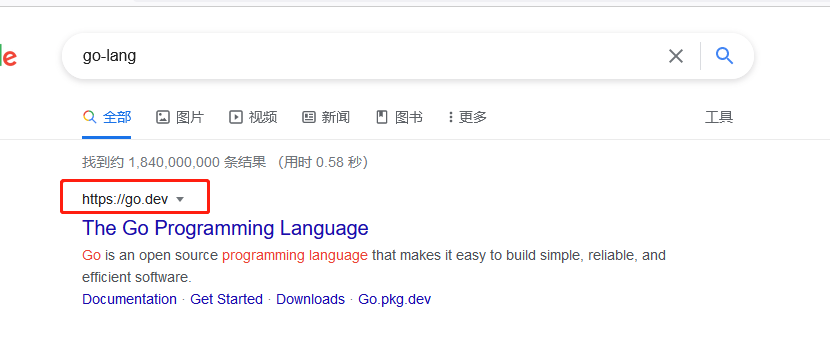
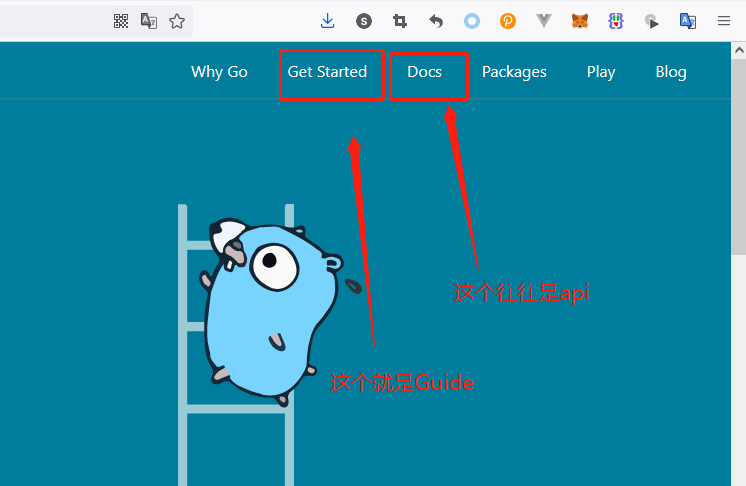
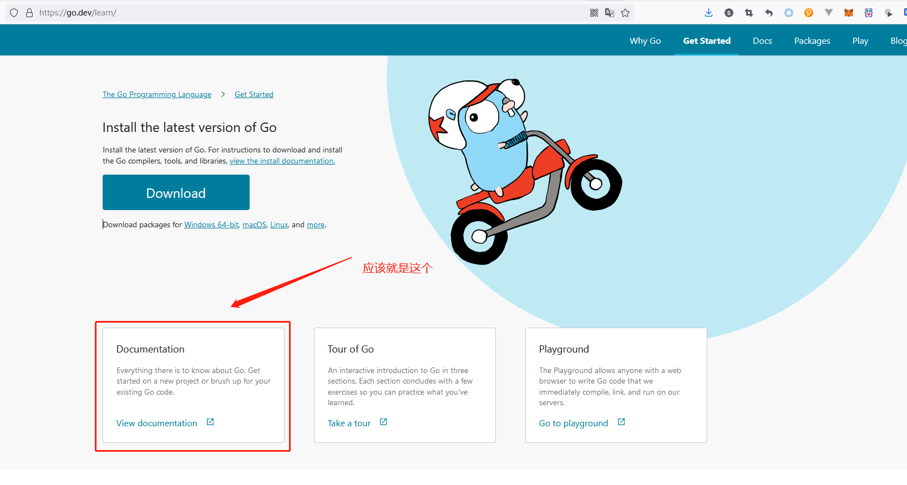
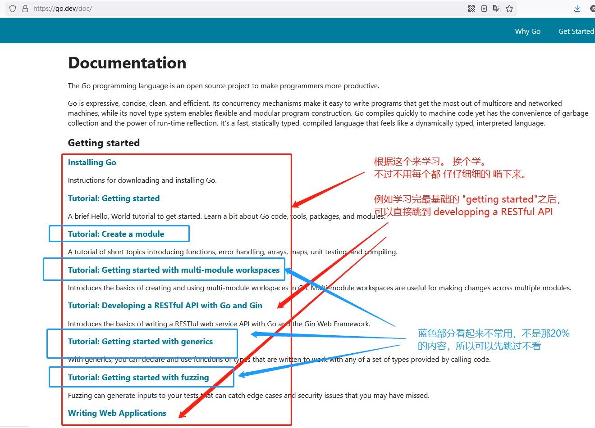
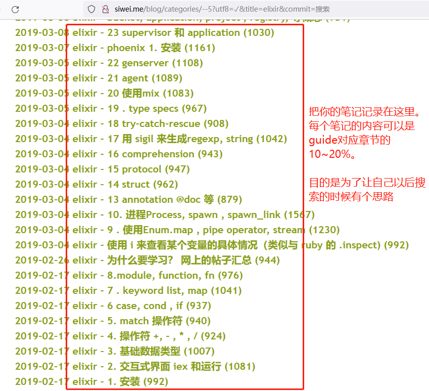
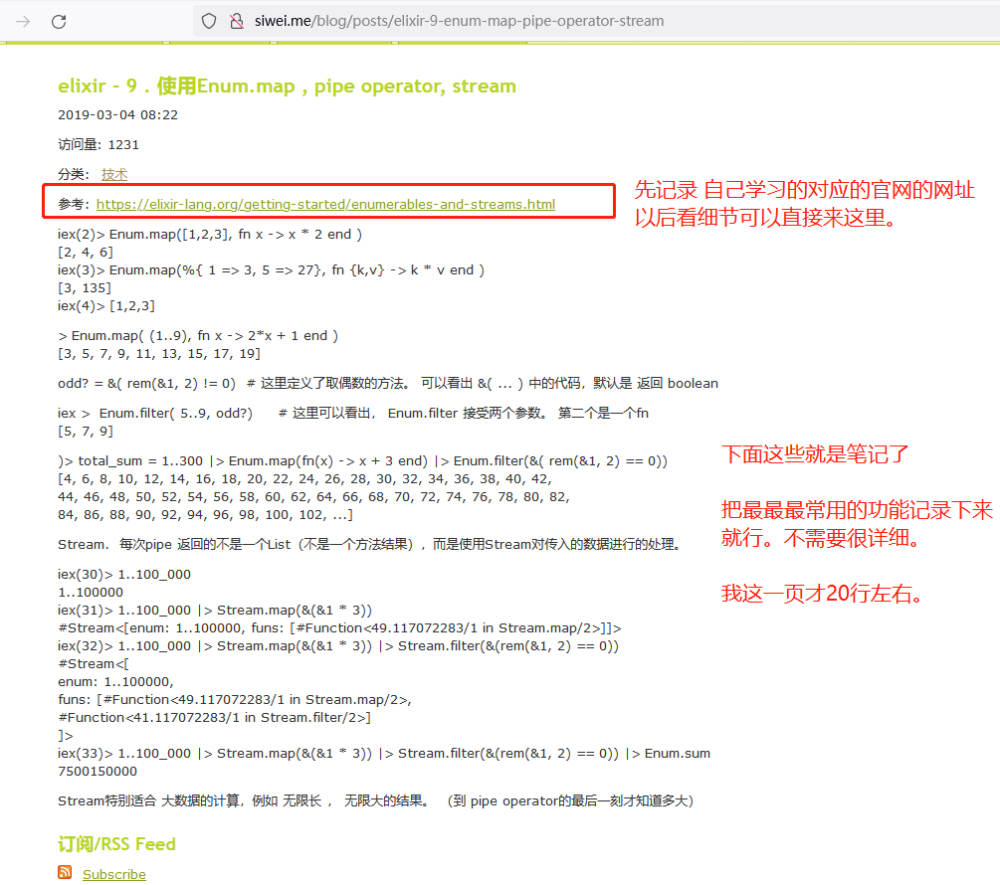

# 如何快速学习（IT领域）

IT领域的学习，基本上就是为了快速解决问题。所以没必要一个小技能点就投入上百个小时。

学习办法是：

1. 找到根源文档
2. 使用2-8定律，只学习最常用的20%的内容
3. 学习的时候不要只用眼睛看，而是要搭建好运行环境，敲代码
4. 及时把学习的内容做个浓缩型的笔记
5. 有个demo就好，想深入的话，“随用随查”。就当这个技术是个字典，需要的时候现翻就好了。

浪费时间的学习办法：报培训班

我最看不起的就是培训班的老师，他们往往是在外面找不到工作的人。真正的开发大神都在办公室领股票，开发熟手都在一线敲代码。
做培训班的老师极少是从一线退下来的。

而且培训班的另一痛点是： 很简单的东西他们要录上百小时的课，很多很多无用的内容，浪费学员的时间。

## 以自学GO为例子。

首先，我们要知道文档分成两种：1. Guide   2. API

Guide就是入门教程，这个就是我们学习的最好教材。

API则是代码的接口文档，非常细节，大部分时候晦涩。

1.首先google搜索到go lang , 第一个结果就是官网。

2.找到对应的Guide

3.继续找Guide

4.只学习最常用的20%。

如果自己无法判断，那就每个都学一点儿，混个脸熟，然后在后续的实际项目中使用。

5.务必要记录笔记。 而且你的 博客要公开（这样能给搜索引擎爬）， 不要弄成私有，谁在乎一个小菜鸟的博客？ 不要敝帚自珍，你的博客只有你自己关心。跟你的代码一样（基本只有你自己才看)

6.记录好博客。把关键的步骤记录下来。

